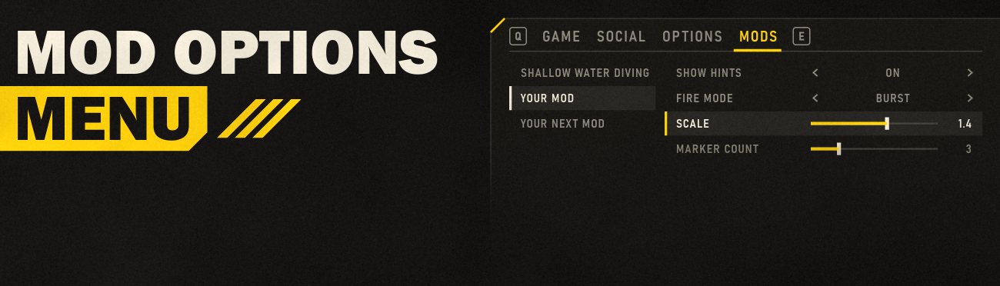

# Mod Options Menu v1.2

Adds a native **MODS** tab beside GAME, SOCIAL and OPTIONS in the escape menu. Each mod that registers options gets a category button (with more than 8, the buttons show 7 mods at a time and the 8th turns the page), and its options appear as native rows (up to 32 per mod): toggles, choices and sliders, with descriptions in the game's description box. Values are saved to `%LOCALAPPDATA%\CowboyBingus\Helldivers2\Logs\ModOptionsMenu.values`, with the previous save kept beside it as `ModOptionsMenu.values.bak` (read if the values file is missing or damaged; to reset every option, delete both).

Changes work as on the OPTIONS tab: they take effect when you press **APPLY** (Tab on keyboard, or the button the hint shows). Leaving the tab or closing the menu with unapplied changes brings up the game's **UNAPPLIED CHANGES** prompt; confirming it discards them, and the next Back leaves.

[Shallow Water Diving](https://github.com/CowboyBingus/ShallowWaterDiving/releases/latest) adds its maximum dive depth slider here, and [Better Lobby Management](https://github.com/CowboyBingus/BetterLobbyManagement/releases/latest) its options.

Install [the release ZIP](https://github.com/CowboyBingus/ModOptionsMenu/releases/latest) and [Bingus Shared Loader v18 or newer](https://github.com/CowboyBingus/BingusSharedLoader/releases/latest), plus the mods that use it. Enable and deploy, then restart the game. Keep the shared loader as the winning Wwise startup replacement. Vanilla Plus Megapack also contains Mod Options Menu as an option; use either the Megapack option or this package, not both.

Translatable: the MODS tab follows the game's Text Language, and so do the options of mods that pass their texts as functions (see below). [How to translate](TRANSLATING.md).

Steam build **25480438** only: the addon checks the game.dll and EXE hashes (through Bingus Shared Runtime, which hashes each file once per session for every mod that uses it) and every native entry point before touching the menu. Its update runs on the runtime's guard: an error in an update below it pauses it, an open MODS tab going back to the game, until the updates below run cleanly again. With the escape menu closed it costs one small memory read per frame; with it open, two. Neither allocates. Measured in recorded play: about 0.006 ms per frame aboard the ship and 0.002 ms per frame in missions.

## For mod authors

```lua
-- HD2-Addon: mods/example/your_mod
local registered = false
local function step()
    local menu = rawget(_G, 'ModOptionsMenu')
    if registered or not menu or menu.api ~= 1 then return end
    registered = true -- The two addons may load in either order.
    menu.register_option('example.your_mod.hints', {type = 'toggle', label = 'Show Hints', mod = 'Your Mod',
                                                    mod_id = 'example.your_mod', default = true,
                                                    description = 'Shows button hints above the crosshair.'})
    menu.register_option('example.your_mod.mode', {type = 'choice', label = 'Fire Mode', mod = 'Your Mod',
                                                   mod_id = 'example.your_mod',
                                                   choices = {'Single', 'Burst', 'Auto'}, default = 1})
    menu.register_option('example.your_mod.scale', {type = 'slider', label = 'Scale', mod = 'Your Mod',
                                                    mod_id = 'example.your_mod', min = 0.5, max = 2, step = 0.1,
                                                    default = 1, description = 'Size of the markers.'})
    menu.register_option('example.your_mod.count', {type = 'slider', label = 'Marker Count', mod = 'Your Mod',
                                                    mod_id = 'example.your_mod', min = 1, max = 10,
                                                    default = 3}) -- whole numbers
    menu.on_change('example.your_mod.hints', function(value) --[[ apply value ]] end)
end
local previous_update = rawget(_G, 'update')
update = function(dt)
    step()
    if type(previous_update) == 'function' then return previous_update(dt) end
end
```

- `register_option(id, spec)` returns `true`, or `false` and a reason: log the reason and keep your default when it is `false`. `id` keys the saved value, so keep it stable (up to 96 bytes, no control characters).
- Categories: pass `spec.mod_id` (preferred; api `version` 3, ignored by older versions), a stable id such as `'author.your_mod'` (letters, digits and `_ . - / :`, up to 64 characters). Every option with that id lands in your category whatever `mod` says, and the button shows the name your first registration gave. `spec.mod` names the button (default: your addon's entry name). Without a `mod_id`, a category belongs to the addon that registers it and the mod name it gave first (a name that follows the game's language still keeps one category), and two mods with the same name get a category each, with a line in the log.
- Limits (`menu.max_mods`, `menu.max_options`):
  - 112 mods: the first 112 mods to register get a category each, shown in alphabetical order. Up to 8 have a category button each; with more, the buttons show 7 mods at a time and the 8th button (PAGE 1 OF 2...) opens one row whose arrows turn the page, up to 16 pages. A further mod's `register_option` returns `false` with the reason `all 112 mod categories are in use` (api `version` 3 and later; older versions returned `true` and never showed a mod past the 8th).
  - 32 options per mod: a 33rd returns `false` with `mod already has 32 options`.
  - Options cannot be unregistered, and a category stays for the session.
  - Slider numbers must be finite and fit a float, as the game keeps them: NaN and infinities are refused as `min`, `max`, `step` or `default` (`slider min, max and step must be finite floats`, `invalid default`) and by `set` (`invalid value`); a saved NaN or infinity loads as the option's default, and a MODS row the game or another mod sets to one goes back to its value instead of becoming an edit.
- `spec.gap = true` adds space above the row; `spec.description` (plain text, up to 400 characters) appears in the game's description box beside the rows while the option is selected. Options without one hide the box.
- Texts are UTF-8 in any script. Limits count characters: label 64, mod name 40, each choice 48, description 400 (v1.0 counted bytes). Mod names and choices are shown in upper case, which works for accented, Greek and Cyrillic letters too.
- Translated texts (api `version` 2, v1.1 and later): `label`, `mod`, `description` and each choice may be a function that returns the text in the current language. The menu calls it when you register and again each time the escape menu opens, where the game's Text Language is changed, so your options follow the language. A function that fails or returns an unusable text keeps the text shown before. With `menu.version` 1 (v1.0), pass strings. Mods that use `bingus_text.lua` pass `function() return tr('key') end`; see [TRANSLATING.md](TRANSLATING.md).
- Types:
  - `toggle`: value `true` or `false`; `default` is `false` unless given.
  - `choice`: `choices` lists 2–16 names; the value is the 1-based index (`default` 1 unless given). Choice words the game already has (ON, OFF, LOW, HIGH…) are shown in the game's own translation: pass them as plain English strings.
  - `slider`: `min`, `max` and `step` (default 1), with `min < max` and `0 < step <= max - min`, all finite, with `max - min` up to 3.4e38 and `step` at least 1.2e-38 (a float's range); the value is a number snapped to the step (`default` is `min` unless given; a finite value out of range is clamped). The row shows as many decimals as `step` needs (at most 3); a whole-number `step` and `min` give an integer slider.
- `get(id)` returns the applied value; `set(id, value)` changes it from code (replacing any unapplied edit of it) without calling callbacks, and a row showing it follows on the next frame; `on_change(id, fn)` calls `fn(value, id)` when the player applies a change. `ready()` reports whether the native menu integration is active.

## Build and test

Clone [Bingus Shared Loader](https://github.com/CowboyBingus/BingusSharedLoader) beside this repository (or set `BINGUS_SHARED_LOADER` to its path); the build uses its `scripts/archive.py` and `scripts/build_addon.py`. `src/bingus_runtime.lua` and `src/bingus_memory.lua` are [Bingus Shared Runtime](https://github.com/CowboyBingus/BingusSharedRuntime)'s files, copied byte-identical and never edited here; the build checks their SHA-256.

- `python tests/run_game_lua.py --run tests/test_options_tab.lua` drives the tab against simulated game memory in the game's own `lua51.dll` (set `HD2_LUA51_DLL` for a nonstandard installation).
- `python tests/run_game_lua.py --run tests/test_values.lua` checks what the values file gets and when; `tests/test_categories.lua` checks which mods get a category; `tests/test_slider_numbers.lua` checks that NaN and infinite slider numbers are refused (`python -B tests/game_lua.py <test> [arguments]` runs any test with arguments).
- `python tests/run_game_lua.py --run tests/test_ffi_names.lua` checks that the addon works next to other mods' Windows SDK declarations of the same functions, declared before or after it; `tests/test_hostile.lua` does the same with wrong prototypes declared first and a failing update below the addon (`tests/hostile_vm.lua`, from Bingus Shared Runtime).
- `python -B scripts/build.py` first runs every `tests/test_*.lua` in a LuaJIT (`HD2_LUAJIT`, else the workspace build in `tools/src/LuaJIT/src` above this repository, else `luajit` on PATH) and in the game's `lua51.dll` (`tests/game_lua.py`), and stops at the first failure. It then assembles `src/bingus_text.lua`, `locales/`, the other `src/` files (each as a function of its own) and `src/mod_options_menu.lua` into one entry (`scripts/entry.py`), checks it compiles in the game's `lua51.dll` and builds `releases/Mod-Options-Menu-v1.1.zip` and the live test addon `build/Mod-Options-Test-Addon.zip` (twelve sample mods, enough for two pages; logs to `ModOptionsTest.log`).

[Changes](CHANGELOG.md) · [Release notes](docs/RELEASE_NOTES.md) · [Validation](docs/VALIDATION.md) · [Artwork](assets/ARTWORK.md)

**AI disclosure:** Claude Opus 5.5 assisted with research, implementation, tests, documentation and artwork.

## License

Zero-Clause BSD (0BSD): use, copy, modify and distribute for any purpose, with no conditions. See `LICENSE`.
